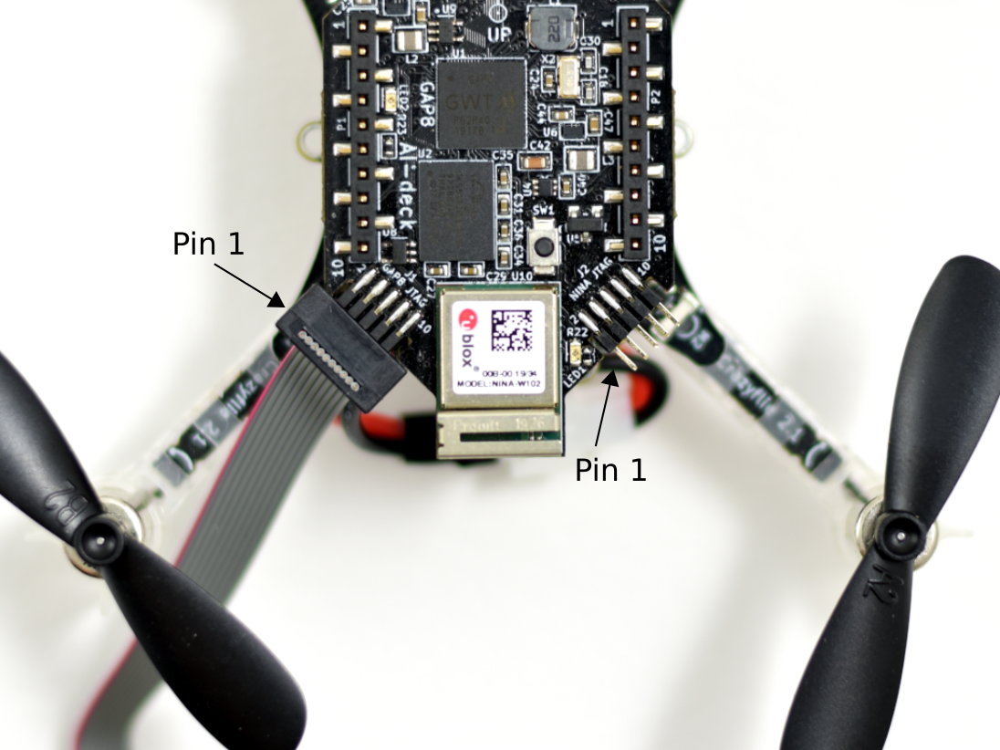

# This is a modified version of [version 3.8.1 of the gap_sdk](https://github.com/GreenWaves-Technologies/gap_sdk/tree/release-v3.8.1), tailored to the BitCraze A.I. Deck

## Getting started with the GAP SDK

### Ubuntu 18.04/20.04

#### OS Requirements installation

These instructions were developed using a fresh Ubuntu 20.04 (Focal Fossa)
64-Bit virtual machine from
[OS-Boxes](https://www.osboxes.org/ubuntu/#ubuntu-1804-info).

The following packages need to be installed:

```bash
sudo apt-get install -y \
    autoconf \
    automake \
    bison \
    build-essential \
    cmake \
    curl \
    doxygen \
    flex \
    git \
    gtkwave \
    libftdi-dev \
    libftdi1 \
    libjpeg-dev \
    libsdl2-dev \
    libsdl2-ttf-dev \
    libsndfile1-dev \
    graphicsmagick-libmagick-dev-compat \
    libtool \
    libusb-1.0-0-dev \
    pkg-config \
    python3-pip \
    rsync \
    scons \
    texinfo \
    wget
```

For Ubuntu 20.04 only:

```bash
sudo update-alternatives --install /usr/bin/python python /usr/bin/python3 10
```

This will setup a "python" binary pointing at python3.

##### GAP8 OpenOCD
Clone, build and install OpenOCD for GAP8:

```bash
git clone https://github.com/GreenWaves-Technologies/gap8_openocd.git
cd gap8_openocd
./bootstrap
./configure --program-prefix=gap8- --prefix=/usr --datarootdir=/usr/share/gap8-openocd
make -j
sudo make -j install

#Finally, copy openocd udev rules and reload udev rules
sudo cp /usr/share/gap8-openocd/openocd/contrib/60-openocd.rules /etc/udev/rules.d
sudo udevadm control --reload-rules && sudo udevadm trigger
```

Now, add your user to dialout group.

```bash
sudo usermod -a -G dialout <username>
# This will require a logout / login to take effect
```

Finally, logout of your session and log back in.

If you are using a Virtual Machine make sure that you give control of the FTDI
device to your virtual machine. Plug the GAPuino into your USB port and then
allow the virtual machine to access it.
For example, for VirtualBox go to Devices->USB and select the device.

Please also make sure that your Virtual Machine USB emulation matches your PC
USB version. A mismatch causes the USB interface to be very slow.

The following instructions assume that you install the GAP SDK into your home
directory. If you want to put it somewhere else then please modify them
accordingly.

## Download and install the toolchain

Now clone the GAP SDK and the GAP/RISC-V toolchain:

```bash
git clone https://github.com/GreenWaves-Technologies/gap_riscv_toolchain_ubuntu_18.git
```

Install the toolchain (this may require to launch the script through sudo):

```bash
cd gap_riscv_toolchain_ubuntu_18
./install.sh
```

Finally, clone version 3.8.1 the sdk (adapt gap_sdk path according to your needs)


```bash
git clone https://github.com/GreenWaves-Technologies/gap_sdk.git --branch release-v3.8.1
```

## Configure the SDK

Source the A.I. deck config

```bash
source configs/ai_deck.sh
```

## Minimal install (FreeRTOS only, no neural network tools)

We will first make a minimal install to check whether previous steps were
successful.
If you are only doing board bringup or peripheral testing, this install will
also be a sufficient.

### Python requirements

Our modules (gapy runner) require a few additional Python packages that you
can install with this command from GAP SDK root folder:

```bash
pip3 install -r requirements.txt
pip3 install -r doc/requirements.txt
```

## OpenOCD


You have to install the system dependencies required by OpenOCD.
You can find them in [OpenOCD README](http://openocd.org/doc-release/README).

There are different cables setup by default for each board. In case you want to
use a different cable, you can define this environment variable:

```bash
export GAPY_OPENOCD_CABLE=interface/ftdi/JTAG_programmer.cfg
```

I had difficult exporting my own `custom.cfg` file. To fix this, I replaced the config files the SDK is pre-configured with my own. 

```bash
sudo find / -name olimex-arm-usb-ocd-h.cfg
#Replace all of the found files with your custom cfg file that is renamed to olimex-arm-usb-ocd-h.cfg
```

### SDK install

First, use the following command to configure the shell environment correctly
for the GAP SDK.
It must be done for each terminal session:

```bash
cd path/to/gap_sdk
# Choose which board
source configs/ai_deck.sh
```

Tip: You can add an "alias" command as follows in your .bashrc file:

```bash
alias GAP_SDK='cd path/to/gap_sdk && source configs/ai_deck.sh'
```

Typing `GAP_SDK` will now change to the gap_sdk directory and execute the source
command.

Once in the SDK, run `make help` to get commands and get SDK ready to use.

```
$ make help
=================== GAP SDK ===================

Main targets:
 - clean       : clean the SDK
 - all         : build the whole SDK with all tools
 - minimal     : get latest sources for all rtos and libs
 - gvsoc       : build GVSOC simulation platform
 - openocd.all : build OpenOCD tools to run simulation on boards
```

Then, compile the minimal set of dependencies to run examples on either GVSOC or boards:

```bash
make minimal
# Build GVSOC simulation platform
make gvsoc
# Build openocd tools to flash and run simulation on boards
make openocd.all
```

### Build SDK Doc

SDK Doc is build and generated based on SPHINX [https://www.sphinx-doc.org/en/master/], the SDK will have installed all the necessary packages for you.  
You just need to run:

```bash
cd doc
make html
```

This will generate the doc in HTML in 
```
doc/_build/html/  
```
and open the file index.html with your browser

## How to flash
My programmer was not configured properly so it sometimes was unable to pull reset low. These instructions provide a work around. 

Connect a JTAG programmer to the GAP8 header on the AI Deck. Then, pull the reset pin of the ESP32 header low. I used the ESP32's reset and pin 10 of component P1 according to this [schematic](https://www.bitcraze.io/documentation/hardware/ai_deck_1_1/ai-deck-revc.pdf) to reset the GAP8. Use one of the below make commands like run or flash to program the board. Once the programmer starts and it prints `Burst read timeout`, stop pulling the ESP32's reset low, and the GAP8 should be programmed. 

## JTAG adapter/debugger
The GAP8 SDK has recently added support for OpenOCD and debuggers with a FTDI interface should be usable. Bitcraze tested programming using the Olimex ARM-USB-TINY-H and JLINK. The same applies to the ESP32 and a rule of thumb is that if the JTAG debugger is compatible with the ESP32, it also works for the GAP8. The STLink v2 will not work as it can only debug Cortex cores.

Tested programmers at Bitcraze AB:
- Olimex ARM-USB-TINY-H

> It's a good choice to follow our hardware selection, you could find detailed information about Olimex Debugger in [USER’S MANUAL](https://www.olimex.com/Products/ARM/JTAG/_resources/ARM-USB-TINY_and_TINY_H_manual.pdf), it's helpful for you to learn how to use debugger with OpenOCD. The Olimex debugger needs a USB type B cable which might not be that common anymore, just a heads up.

## JTAG connectors
There are two Cortex-M 10pin (2×5, 1.27mm pitch) JTAG interfaces on the AI-deck so that both the GAP8 and the ESP32 can be programmed and debugged easily. They are edge mounted on the PCB to save height. The GAP8 JTAG is located on the left side and the ESP32 JTAG to the right when viewing the board from the top and camera front. Note that pin-1 is located to the left, marked with a 1 on the bottom side of the board.

Use a 2×5 pin 1.27mm (0.05“) flat cable together with our [debug adapter](https://www.bitcraze.io/debug-adapter-kit) or e.g. an adapter such as the [Olimex ARM-JTAG-20-10](https://www.olimex.com/Products/ARM/JTAG/ARM-JTAG-20-10), is needed to connect the debugger and the AI-deck. 



## Note
It has been found that the Himax monocrom module seem to consume so little power that the JTAG can "phantom" power it and cause it to end up in an unknown state. Therefore it might be nescessare to unplug the JTAG if the AI-deck/Crazyflie is power cycled and plug it back in after it is powered again.

### Helloworld

Finally try a test project. First connect your GAPuino to your PCs USB port.
Now, you should be able to run your first helloworld on the board.

```bash
cd examples/pmsis/helloworld
make clean all run PMSIS_OS=freertos platform=board
```

In details, `PMSIS_OS`, `platform`, `io` are used to configure the RTOS to run
the example on, specify the runner, and select the output for printf.

* PMSIS_OS : RTOS (freertos/pulpos)
* platform : board gvsoc rtl fpga (defult if not set is gvsoc)
* io       : disable host(semihosting) uart rtl (defult if not set is semihosting)

After the build you should see an output resembling:

```
     *** PMSIS HelloWorld ***

     Entering main controller
     [32 0] Hello World!
     Cluster master core entry
     [0 7] Hello World!
     [0 0] Hello World!
     [0 4] Hello World!
     [0 5] Hello World!
     [0 3] Hello World!
     [0 1] Hello World!
     [0 2] Hello World!
     [0 6] Hello World!
     Cluster master core exit
     Test success !
     Detected end of application, exiting with status: 0
     Loop exited
     commands completed
```

If this fails, ensure that you followed previous steps correctly (openocd
install, udev rules).
If libusb fails with a permission error, you might need to reboot to apply all
changes.

If you need GAP tools for neural networks (nntool) or the Autotiler, please
follow the next section

If you just wish to also have access to pulp-os simply type:

```bash
# compile pulp-os and its librairies
make pulp-os
```

And replace `PMSIS_OS=freertos` by `PMSIS_OS=pulpos` on your run command line.

## Full Install

### Python requirements

In order to use the GAP tools for neural networks (nntool), we strongly
encourage to install the Anaconda distribution (Python3). You can find more
information on [Anaconda website](https://www.anaconda.com/).

Note that this is needed only if you want to use nntool, you can skip this step
otherwise. Once Anaconda is installed, you need to activate it and install
Python modules for this tool with this command:

```bash
pip install -r tools/nntool/requirements.txt
pip install -r requirements.txt
```

### Pull and compile the full tool suite

Finally, we install the full tool suite of the sdk (including nntool and
autotiler).

```bash
make sdk
```

Note that if you only need autotiler (and not nntool) you can instead use:

```bash
make all && make autotiler
```

## Using the virtual platform

If you only followed
[Minimal installation](#minimal-install-freertos-only-no-neural-network-tools)
process, begin by compiling gvsoc:

```bash
make gvsoc
```

You can also run this example on the GAP virtual platform with this command:

```bash
make clean all run platform=gvsoc PMSIS_OS=freertos/pulpos
```

### Using the virtual platform 
#### Using VCD traces with GTKWave

You can also generate VCD traces to see more details about the execution:

```bash
make clean all run platform=gvsoc runner_args=--vcd
```

You should see a message from the platform telling how to open the gtkwave files (view.gtkw).

In case you don't have any file but you still want to upload the flash image,
for example for booting from flash, you can execute after you compiled your
application:

```bash
make flash
```

In case you specified files, the command `make all` will not only build the
application but also build the flash image and upload it to the flash.
In case you just want to build your application, you can do:

```bash
make build
```

Then after that if you want to produce the flash image and upload it,
you can do:

```bash
make image flash
```
