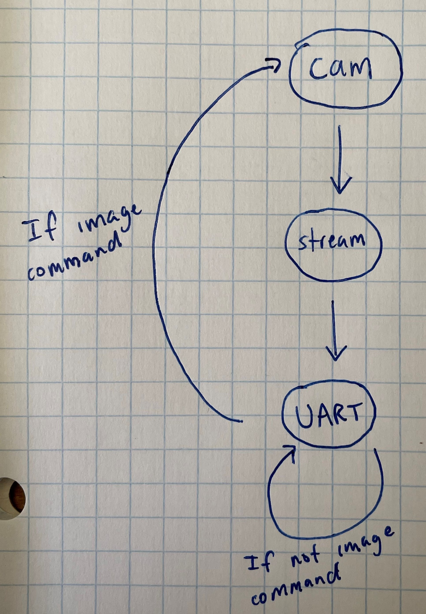

## To program the GAP8 chip, follow [these instructions](JTAG_Programming.md)

The image shows the state machine used to read from UART and send image data across WiFi. `test.c` includes comments of how the code works

